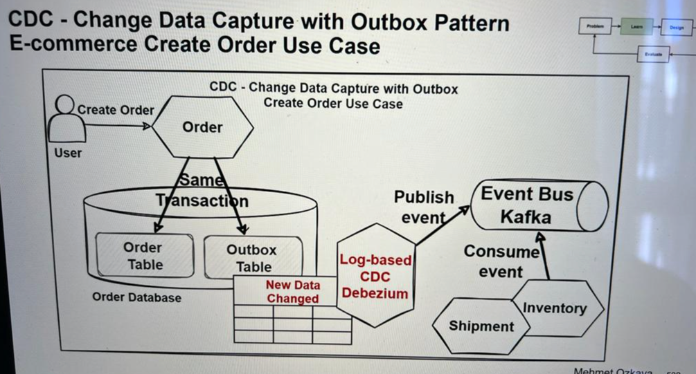

# Demo for Server Sent Event
Just a quick demo on how to use SSE with Spring Webflux.

- More about SSE: https://medium.com/deliveryherotechhub/what-is-server-sent-events-sse-and-how-to-implement-it-904938bffd73

# Distributed Transactions

#### ACID

- Atomicity
  - all operations are executed successfully or everything fails and rollback together. 
- Consistency
  - the data in the DB is kept in a valid and consistency state.
- Isolation
  - You can have multiple transactions running concurrently and they won't interfere with each other.
- Durability
  - Once the transaction is committed, the changes are stored.

If one change fails on database, the whole transaction is going to fail and the DB will remain in the previous state.
Relational databases are providing the ACID principle.

#### Eventual Consistency

Microservices sacrifice the ACID principles (strong consistency) to have high scalability and availability.
It is when we face the Eventual consistency. 
The microservices can't guarantee the data consistency between other microservices.
For that some approaches include event-driven architecture, SAGA pattern, etc. 
That leads to a compensation strategy, where if one microservice fails we have to rollback all the impacted ones.
It is important to be resilient and idempotent to avoid redundant events processing.

#### Microservice Transaction Boundaries

In DDD Bounded Context means the closely related scopes between contexts.

Eg.: Sales Context and Support Context can have their Customer and Product table very dependent on each other.
Although they live in different contexts, they have the boundaries between those tables.

More: https://martinfowler.com/bliki/BoundedContext.html

But, **how to identify Microservices Transactional Boundaries**?

Transactional Boundaries are small units of atomicity that need to provide consistency between them.

An Order should fail if the Payment has failed. For that, there is a pattern to solve that issue: **SAGA Pattern**.

#### Saga Pattern for Distributed Transaction

- This was created to provide a data consistency between several microservices.
- It creates a set of transaction that update microservices sequentially, and publish events to trigger the next transaction.
- It offers a compensation flow to rollback in case any microservice failed.
- It uses the Publish/Subscriber pattern.

##### Choreography based Saga implementation

It uses the **publish-subscribe** pattern, where each microservice will publish the event to a Message Broker in real-time.

###### Benefits
* Decentralized and flexible by using an event-based approach.
* Avoid single point of failure, since there is no orchestrator.
* Simple if it doesn't require too many microservices transaction steps.
###### Drawbacks
* More complex to manage, because each microservice communicates via events. It can be hard to monitor, to coordinate and to add new step into the flow.
* Cyclic Event consume risk. There is a risk to have a cyclic dependency between the microservices.

##### Orchestration based Saga implementation

It will use a **central orchestrator service** to coordinate and manage the individual sagas that emitted the event.
###### Benefits
* Provides a centralized point of control for managing the transactions.
* Make it easier to understand and debug.
###### Drawbacks
* It can become a single point of failure if it goes down.
* It can become a bottleneck, making it hard to scale (similar to a monolith).

#### Dual Write problem

This problem can happen when we have to store the data in two different microservices.
The Service A stores the data in its own database and the publishes a message to Service B to also store it.
If in the meanwhile of publishing to B the application fails, or the message broker fails, or anything happens that
the message is not delivered, you will end up with an inconsistent status: stored in A, but never arrived to B.

Solutions:
- **Transactional Outbox Pattern**
- **CDC** - Change Data Capture
###### Transactional Outbox Pattern

- The idea is to have an "Outbox" table in the Service A (the one persisting in the DB).
- Then the Service A stores the data in 2x table in a **single transaction**: once in the main table and then the Event in the outbox.
- Then we could have a scheduled job (or a listener/sqs/lambda) that would read from that table and publish the event.
- If the event is successfully published, then it can delete that row.
- [Useful link](https://docs.aws.amazon.com/prescriptive-guidance/latest/cloud-design-patterns/transactional-outbox.html)
- Although this seems useful, it comes with a lot of problems:
  - Performance and error-prone operations.
  - Consumes resources for the polling.
  - Can reach system limitations, latencies, etc.
  - Can cause additional Dual-write problem because of the new microservice created.

###### CDC - Change Data Capture
It is a technology that captures CRUD operations in the DB.

- It works by continuously monitoring the **transaction log** of the database for changes.
- Then it extracts and propagate those changes to the target system.
- Then the target system can stay up-to-date with the source system.
- It can be used to replicate data between databases or synchronization features.
- It helps on tracking changes that happens to data in a DB.
- It can be combined with **Outbox Pattern**.
  - Whenever the microservice updates the data in its DB, it will also write a record to the outbox table with the details of the changes.
  - CDC can then be used to monitor the **outbox table** for new records.
  - With this monitoring, it can extract the data changes and propagate them to the target service.
  - This allows the microservice to decouple their data updates from the process of propagating those updates to other services.
  - This can make it easier to scale and maintain a microservice architecture.

  - Databases available:
    - [DynamoDB](https://medium.com/aws-lambda-serverless-developer-guide-with-hands/dynamodb-streams-using-aws-lambda-to-process-dynamodb-streams-for-change-data-capture-2e3ab8df27ca)
    - [CockroachDB](https://www.cockroachlabs.com/docs/stable/change-data-capture-overview)
    - [Azure CosmosDB](https://learn.microsoft.com/en-us/azure/cosmos-db/nosql/change-feed-design-patterns?tabs=latest-version)
    - Red Hat Apache Kafka with CDC using Debezium in event-driven apps.
@Author: LucasDesenv